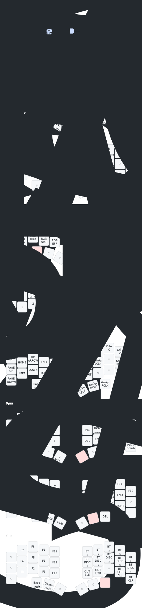

Swoop Keyboard
=============== 

This project is still being developed as I am polishing the keymap for something I really like. Comments and code might be unstructured or incorrect as changes are implemented.

This is the repository to my [Swoop](https://github.com/jimmerricks/swoop) project. Adapted to run wirelessly through ZMK. It's a split wireless-only
mechanical keyboard.

**High level overview**

 * 36-key split wireless keyboard
 * MX switches
 * Per-key LEDs
 * Custom case, keeping wireless and wired builds in mind
 * Case employs Integrated Mounting Style

**Keymap overview**
 * Modified Miryoku QWERTY layout
 * moved GUI key to lower row due to many false activations
 * Added a row of combos and hold/tap delays to make better use of the 36 key layout

## The Case
The case is the designed to mount the keyboard with an integrated plate. It also has some notches to allow for the addition of a partial gasket on the lower case. However, I have not tried it out yet. 
See image below for a general idea of the mounting profile. Only difference is that screws are put in from the top. Optional gasket is marked in orange:


>Image by [Thomas Baart](https://thomasbaart.nl/2019/04/07/cheat-sheet-custom-keyboard-mounting-styles/).


The follwoing shows how the integrated mount is executed. The sectional view also shows the space I left for a gasket:


When assembling the case, adding in some M2x4x3.2 threaded inserts is recommended. M2x4 screws will hold the top frame in place. 
**However**, if you do not have any inserts; I did leave the screw holes at a smaller diameter further down. So if using longer screws (8-10mm), you should be able to get by without inserts.


### Printing the case
There are two case files. One is labelled 'Battery' and provides 4mm of additional space under the mounted PCB. In my build, that allowed me to add 'PL 385677' batteries on the underside of the PCB. These provide 2500mAh - enough to drive LEDs for a few hours. I simply taped them onto the PCB with painters tape.


In order to print the Left/Right side respectively, simply mirror the parts in your slicer. 

**Print Settings**
    * 30% infill
    * Brim recommended, but a good calibrated printer will do without
    * No Supports
    * 0.2mm layer height

## The Keymap



## Building

Either generate the firmware via the GitHub action, or build locally by setting
up the ZMK toolchain as described [here](https://zmk.dev/docs/development/setup).
Given a directory structure like:

```
...
|-- config-temper/
|-- zephyr-sdk-0.16.5-1/
`-- zmk/
    |-- app
    `-- ...
```

Then from the `zmk/app` directory run the following command to build the
firmware for the left hand board:

```sh
west build -b nice_nano_v2 -p -c -- -DSHIELD="temper_left nice_view_adapter nice_view_temper" -DZMK_CONFIG=../../config-temper-zmk/config -DZMK_EXTRA_MODULES=../../config-temper-zmk -DZephyr-sdk_DIR=../../zephyr-sdk-0.16.5-1/cmake
```

This will produce the file `zmk/app/build/zephyr/zmk.utf`. Put the board into
bootloader mode by pressing the reset button twice, and copy this file to the
board, which will show up as a USB drive when connected to your computer. Repeat
for the right side board.

## Keymap image

The keymap image is created using [keymap-drawer](https://github.com/caksoylar/keymap-drawer).
It can be regenerated with the commands:

```sh
keymap -c img/keymap_drawer.config.yaml parse -c 10 -z config/temper.keymap > img/temper.yaml
keymap -c img/keymap_drawer.config.yaml draw -k chocofi img/temper.yaml > img/temper.svg
```


## Miscellaneous

In MacOS, when a key is held down while entering text, a popup is shown which
lets you choose between various accented forms of the character. The following
command will disable this behaviour.

```sh
defaults write -g ApplePressAndHoldEnabled -bool false
```

## Resources

 * https://github.com/urob/zmk-config
 * https://github.com/caksoylar/keymap-drawer

